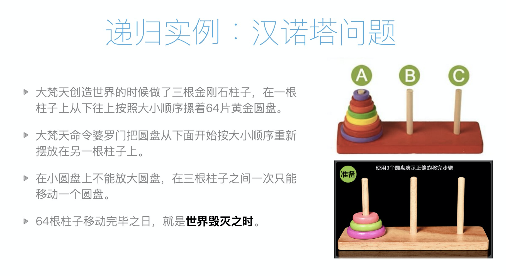
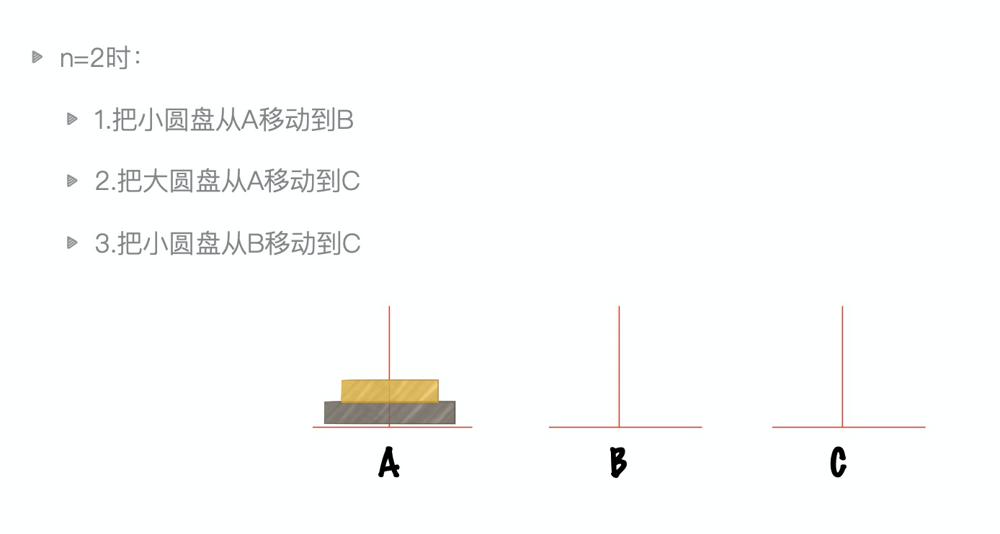
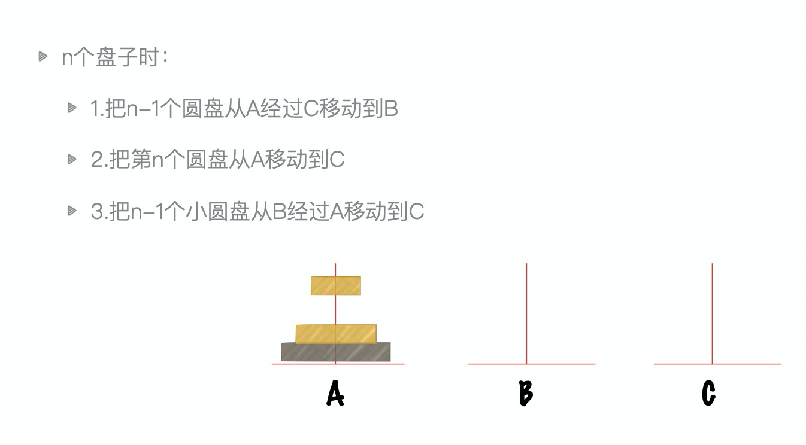

# 递归

## 递归的两个特点

- 调用自身
- 结束条件

```
# 没有终止条件
def fn1(x):
    print(x)
    fn1(x-1)

# 判断条件方向反了
def fn2(x):
    if x>0:
        print(x)
        fn2(x+1)


# 合法的递归
def fn3(x):
    if x>0:
        print(x)
        fn3(x-1)

# 合法的递归
def fn4(x):
    if x>0:
        fn4(x-1)
        print(x)
```

## 汉诺塔






### n个盘子的分析

- **拆分问题**
```
n 和 (n-1) 的问题
n-1 和 n - 2 的问题
n-2 和 n - 3  的问题

。。。。 。。。 

3 和 2 的问题
2 和 1 的问题
1 的问题
```

python版

```
def hanoi(n, a, b, c): 
    if n > 0:
        hanoi(n-1, a, c, b)
        print("moving from %s to %s." % (a, c)) hanoi(n-1, b, a, c)
hanoi(3,'A','B','C')
```


js版

```
function hanoi(n,a,b,c){
   if(n>0){
        hanoi(n-1, a, c , b)
        console.log(`moving from ${a} to ${c}.`);
        hanoi(n-1, b, a, c)  
     
   }
}

hanoi(3,'A','B','C')

```

运行结果

```
"moving from A to C."
"moving from A to B."
"moving from C to B."
"moving from A to C."
"moving from B to A."
"moving from B to C."
"moving from A to C."
```

> 汉诺塔的递推式： `h(x)=2h(x-1)+1`

- h(64) = ......
- 假设婆罗门一秒搬一个盘子，则总共需要 5800亿年！
    - 事实这并不是一个传说，而是为了骗你学数学～～～