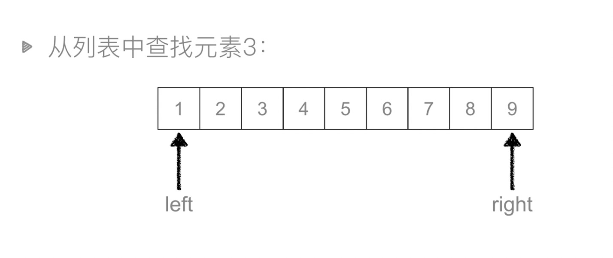
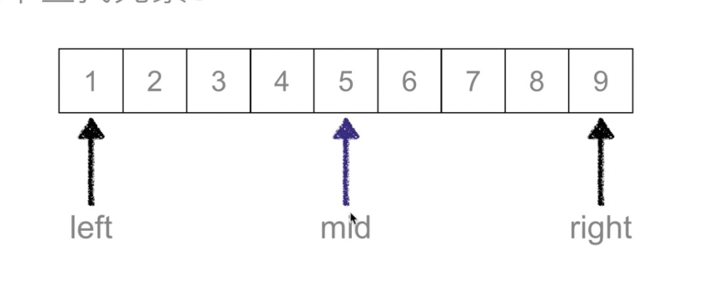
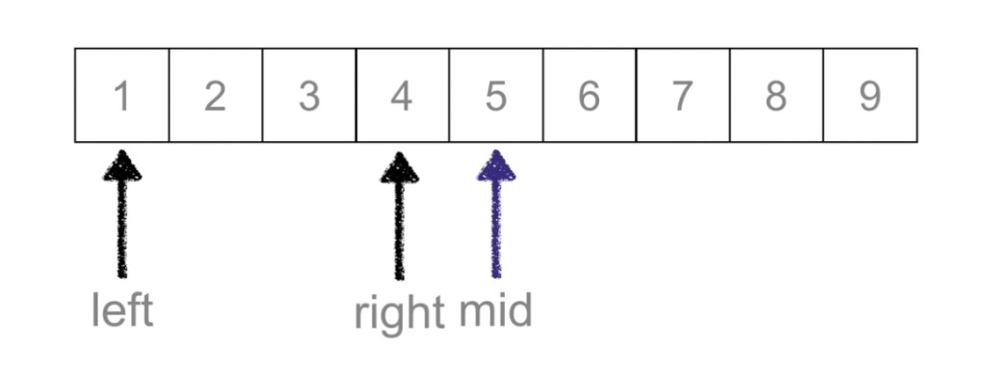
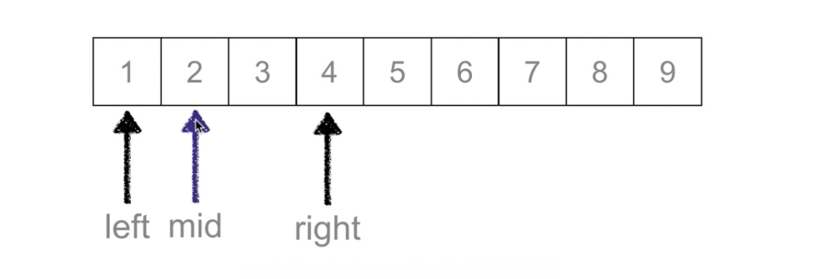
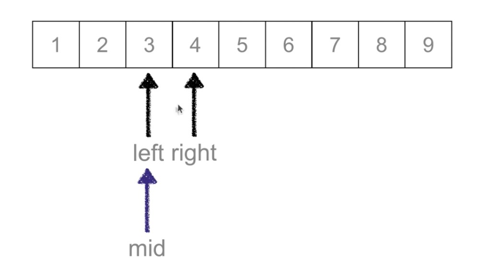

## 二分查找

> 经典高中数学问题 猜价格

- 这个商品 1~1000元 ，假设真实价格812

```
第一次猜 500 ，低了
    此时 1～500 一半的数据被筛掉了
第二次猜 750，低了
    此时 500～750 的数据被筛掉了
第三次猜 875 ，高了
    此时 875～1000 的数据被筛掉了
第四次猜 812 对了
```

### 基本概念

- 有序列表 （从小到大 or 从大到小）
- 留下来的叫做候选区







```
function binary_search(arr,val){
    let left = 0;
    let right = arr.length - 1;
    // 候选区有值
    let count = 0;
    while(left <= right){ 
        console.log(`查找了${count}次`);
        count += 1;
        let mid = parseInt((left + right) / 2)
        if(arr[mid] === val){
            return mid;
        }else if(arr[mid]> val){
            // 待查找的值在 mid左侧
            right = mid - 1;
        }else{
            // 待查找的值在 mid右侧
            left = mid + 1;
        }
    }
    return null
}

let arr = [];
for(var i=0;i<10000;i++){
  arr[i]=i;
};
let res = binary_search(arr,4);
console.log(res)
```

- 时间复杂度 O(logn)

### 结论

- 二分查找比线性查找的效率高
- indefOf 的实现就是 **线性查找**，因为二分查找的要求是 **排序后的列表**

> 如果你只查找一次

- 有序的用 二分查找
- 无序的用 线性查找

> 如果查询的次数很多

- 先排序，然后二分查找

